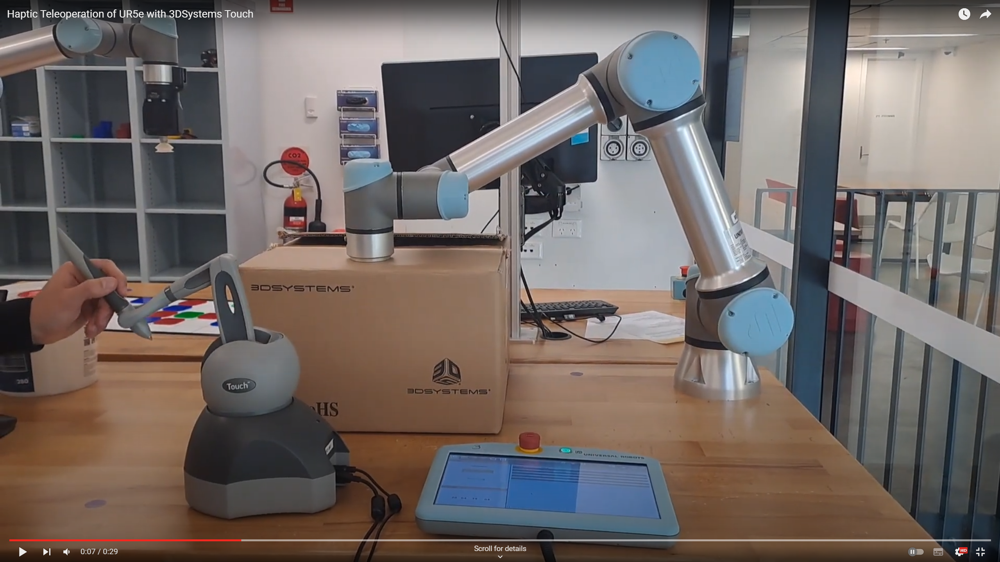

# Haptic Teleoperation of a UR5e with 3DSystems Touch

### See a video of the system in operation:
[](https://www.youtube.com/watch?v=ANDTbs7mhmc-Y "Haptic Teleoperation of UR5e with 3DSystems Touch")

This repository was created as a part of an mechatronic engineering honours thesis at the University of New South Wales (UNSW).

This repository includes files that relate to teleoperating a Universal Robots E-series robot via a 3Dsystems Touch haptic device with haptic feedback for the purposes of improving remote ultrasounds.

The steps below are not written in great detail and assume familiarity with ROS and enough knowledge of ubuntu to bugsplat as issues come up, but should be sufficient to point the users in the correct direction.

Steps to utilize the code:
1. Get an installation of Ubuntu 20.04
2. Install the touch driver from [here](https://github.com/bharatm11/Geomagic_Touch_ROS_Drivers/tree/hydro-devel). The instructions it presents are outdated, **DO NO FOLLOW THEM**, the steps to take are:
    1. Install the dependencies:
        ```
        sudo apt-get install --no-install-recommends freeglut3-dev g++ libdrm-dev\
        libexpat1-dev libglw1-mesa libglw1-mesa-dev libmotif-dev libncurses5-dev\
        libraw1394-dev libx11-dev libxdamage-dev libxext-dev libxt-dev libxxf86vm-dev\
        tcsh unzip x11proto-dri2-dev x11proto-gl-dev
        ```
       Note that while some places want the now defunct ```x11proto-print-dev``` library stated as required in some locations is not actually necessary.  

    2. Install the [openhaptics SDK](https://support.3dsystems.com/s/article/OpenHaptics-for-Linux-Developer-Edition-v34?language=en_US). If link is dead google "openhaptics linux sdk" and install the most recent version.  
    3. Install the Touch driver from the same page. It must be from the same page for compatability.  
    4. Follow the [installation instructions](https://s3.amazonaws.com/dl.3dsystems.com/binaries/Sensable/Linux/Installation+Instructions_2022.pdf). If link is dead follow the pdf on the most recent page of the openhaptics linux sdk install page.  
    5. If on a 64-bit system (so most everyone) run the following:  
    ```
    sudo ln -s /usr/lib/x86_64-linux-gnu/libraw1394.so.11.0.1 /usr/lib/libraw1394.so.8
    sudo ln -s /usr/lib64/libPHANToMIO.so.4.3 /usr/lib/libPHANToMIO.so.4
    sudo ln -s /usr/lib64/libHD.so.3.0.0 /usr/lib/libHD.so.3.0
    sudo ln -s /usr/lib64/libHL.so.3.0.0 /usr/lib/libHL.so.3.0 
    ```  
4. (Optional but highly recommended) Install a realtime kernel on your ubuntu installation, instructions can be found [here](https://github.com/UniversalRobots/Universal_Robots_ROS_Driver/blob/master/ur_robot_driver/doc/real_time.md). Note that these instructions did not work out of the box for me, but are a strong place to start.
5. Setup [ROS Noetic](http://wiki.ros.org/noetic/Installation/Ubuntu) on your installation.
6. Install [catkin_tools](https://catkin-tools.readthedocs.io/en/latest/installing.html).
7. Create a catkin workspace.
8. Install the [universal robots ROS driver](https://github.com/UniversalRobots/Universal_Robots_ROS_Driver) in your catkin workspace and follow its setup instructions up to the end of extracting calibration information.
9. Install moveit_servo following the instructions [here](https://ros-planning.github.io/moveit_tutorials/doc/getting_started/getting_started.html) in your catkin workspace.
10. Download this repository into your catkin workspace.
11. Build and source your catkin workspace. (use catkin build not catkin_make)
12. Run one of the launch files to start, like ```roslaunch ur_to_touch_haptic_teleoperation ur_touch_haptic_teleop.launch```

Known problems (Nothing in active development):
1. The haptic feedback does not rotate with the robot, always assuming position parallel to the default.
2. The filtering used to use smooth motion is imperfect, empirical (and perhaps even silly compared to smarter methods). Some further filtering work is required to stop gurning noises in the robot due to micro movements.
